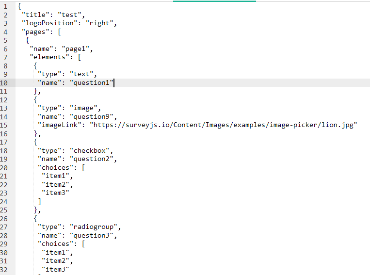
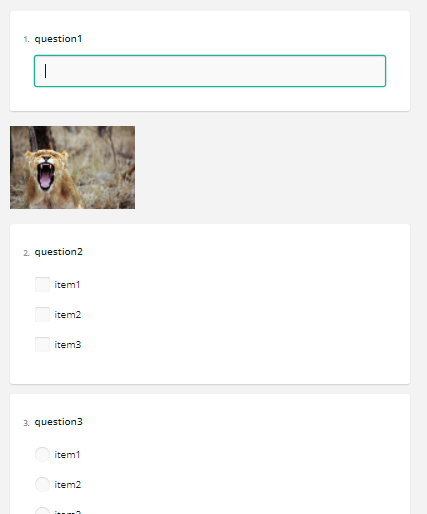
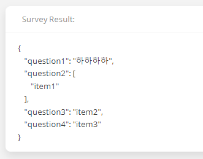

# 설문지 만들기

## 설명

설문지 폼을 json 파일로 정의하면, 설문지를 만들어 주는 사이트이다.

## 요구사항

1. 설문지에는 다향한 컴포넌트들을 json으로 정의하여 사용할 수 있다. 참고) https://surveyjs.io/create-survey

2. 1)처럼 약속된 형식에 맞게 작성한 json을 입력하고 “설문지 만들기”를 하면

3. 2)처럼 설문지를 보여준다. 응답을 작성할 수 있다. “응답하기”를 하면

4. 3)처럼 작성한 응답을 json으로 출력한다.

## 개발 환경

## 기능

- 설문지 만들기
- 설문지 작성
- 설문지 결과 출력

## 데이터 베이스

## 결과

